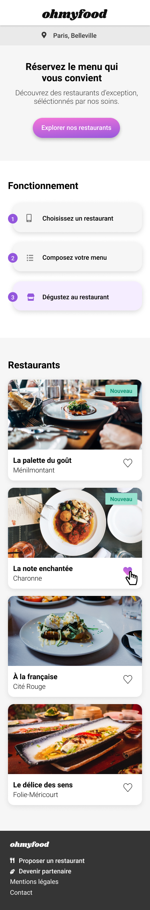

# WalaZitoun_P3_22122020
# Projet 3 OpenClassrooms "Dynamisez une page web avec des animations CSS"

c'est mon troisième projet dans le cadre de ma formation **Developpeur Web**
___

## Démo

https://wala95.github.io/WalaZitoun_P3_22122020/

## Maquettes

Accueil:

Menu:

## Cahier des charges

Réaliser la version mobile responsive en respectant les contraintes techniques suivantes :

- Le développement devra se faire en CSS, sans JavaScript
- L’utilisation de SASS 
- Code HTML et SCSS séparés
- Aucun framework ne devra être utilisé
- Aucun code CSS ne devra être appliqué via un attribut style dans une balise HTML
- Utilisation des couleurs spécifiques:
	- Mauve: #9356DC;
	- Rose: #99E2D0;
	- Vert: #ebebeb;
- Utilisation des polices spécifiques: Roboto, Shrikhand
- Utilisation des balises sémantiques 
- Utilisation du Flexbox et Grid
- Utilisation des icones provenants de la bibliothèque Font Awesome 
- Design responsive et respect des maquettes mobiles fournies :
	- Une version "Mobile" pour un affichage sur les écrans de smartphone de 375px version Mobile
	_ Une version "Desktop" et "Tablette" dont leur mise en page est libre
- Validation du code HTML et CSS au validateur W3C sans erreurs
- Le code doit être versionné : github
- Le site doit être parfaitement compatible avec les dernières versions desktop de Chrome et Firefox
- Les effets graphiques et animations devront utiliser les animations ou transitions CSS, pas de JavaScript ni de librairie

